# 教务综合管理系统(文末获取方式☟)
> 
#### 介绍
教务综合管理系统(Java_SpringBoot)
有BUG可留言加微

#### 软件架构
Java + SpringBoot + Mybatis + thymeleaf + Mysql

#### 项目功能说明

1.  超级管理员功能
> + 学院管理
> + 子管理员管理
2.  学院管理员功能
> + 院系综合管理：教研室管理、专业方向管理、班级管理
> + 课题综合管理：课题来源管理、课题类型管理、课题管理
> + 基础信息管理：教师管理、学生管理
> + 生成课题一览表
3.  教师功能
> + 差旅管理：出差申请、申请详情、出差报告、查看出差报告、申请审核
> + 表格管理：学期述职表、年度述职表、年度考核表、工作量统计表、专业技术人员考核表、教师学期业务情况登记表
> + 我的表格：学期述职表、年度述职表、年度考核表、工作量统计表、专业技术人员考核表、教师学期业务情况登记表
> + 毕业设计：上传课题、课题详情、课题选报情况、班级选报查询、初始学生密码、课题审核
4.  学生功能
> + 查看课题
> + 查看本班选题情况

### 部分功能演示

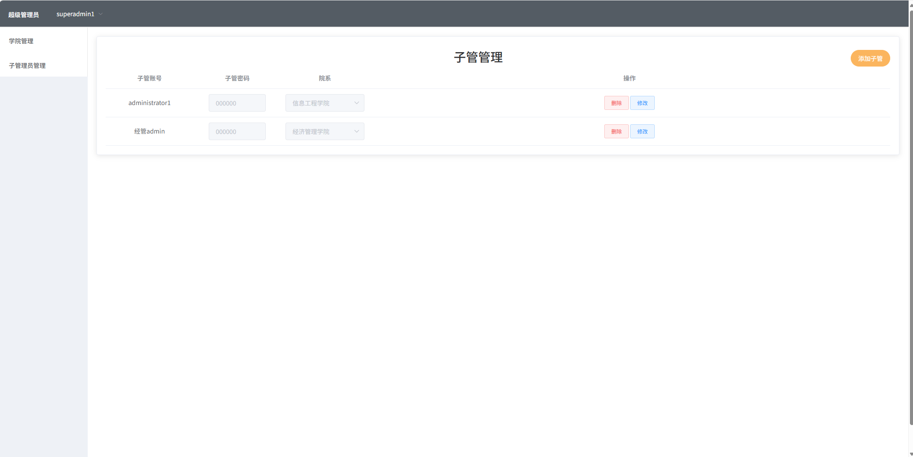
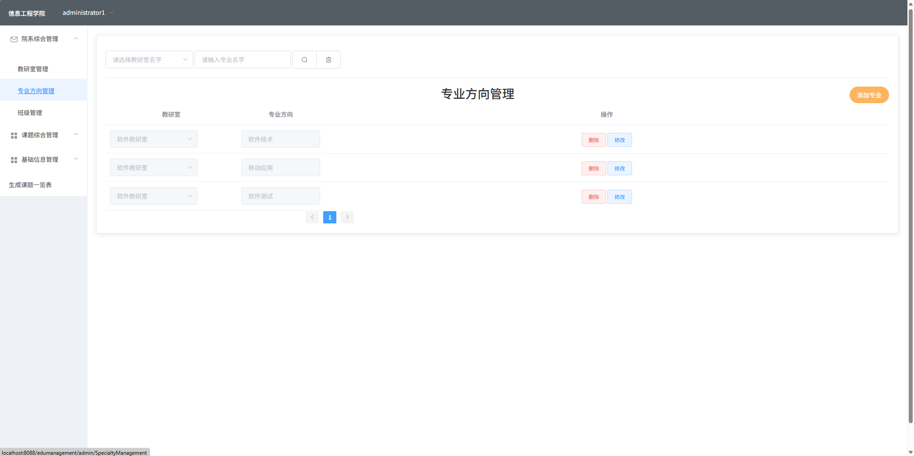
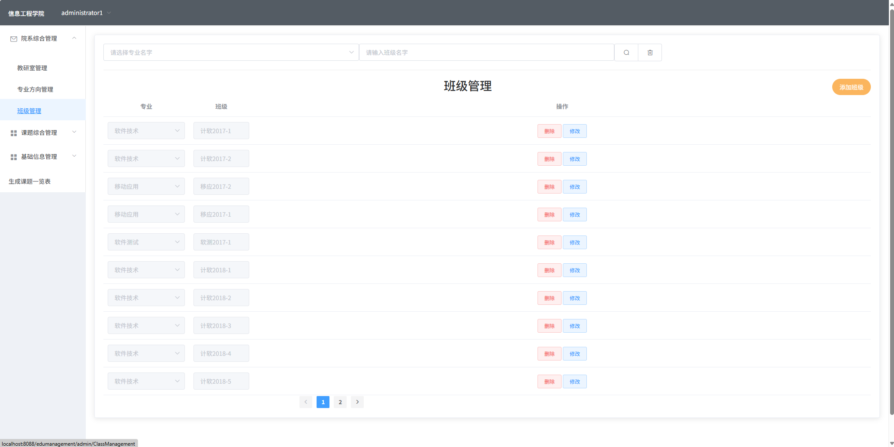
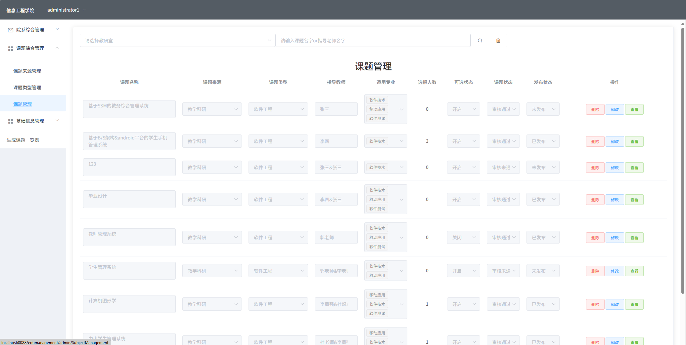
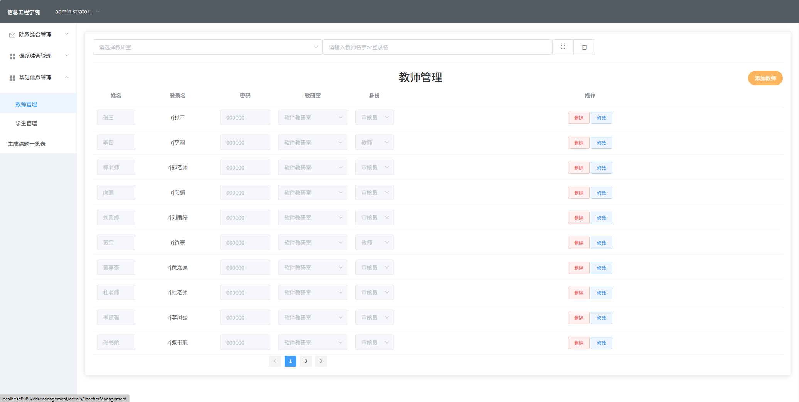
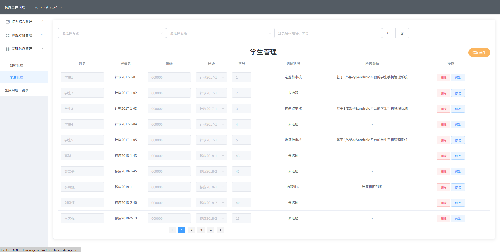
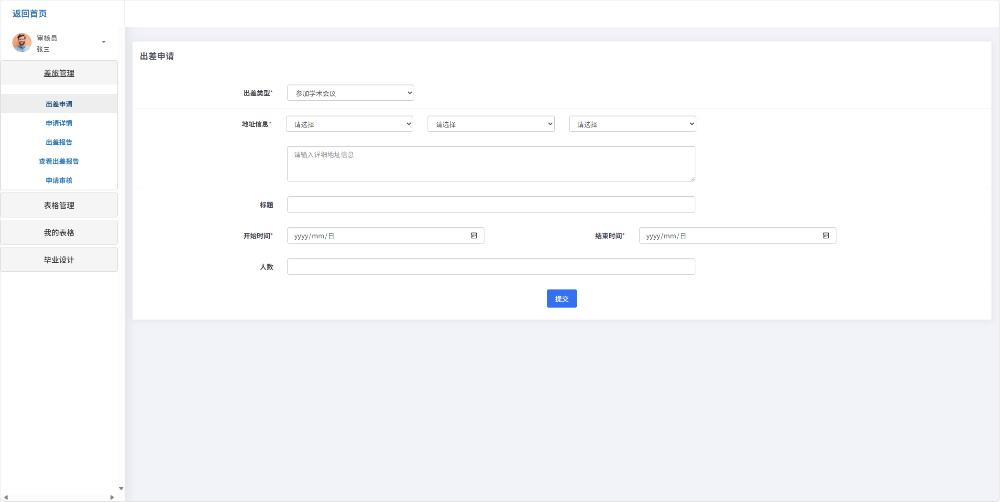
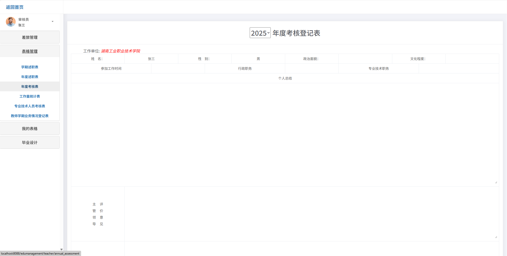
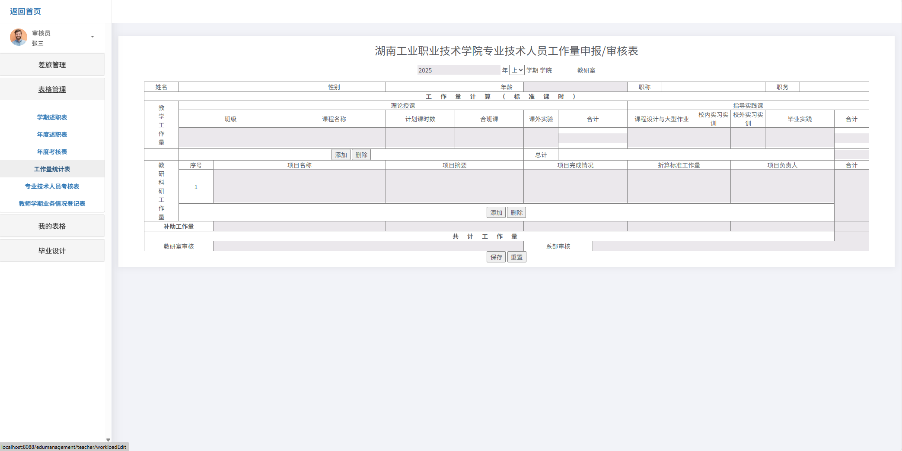
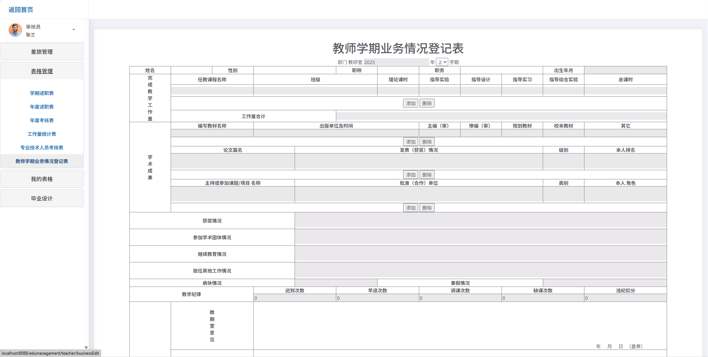
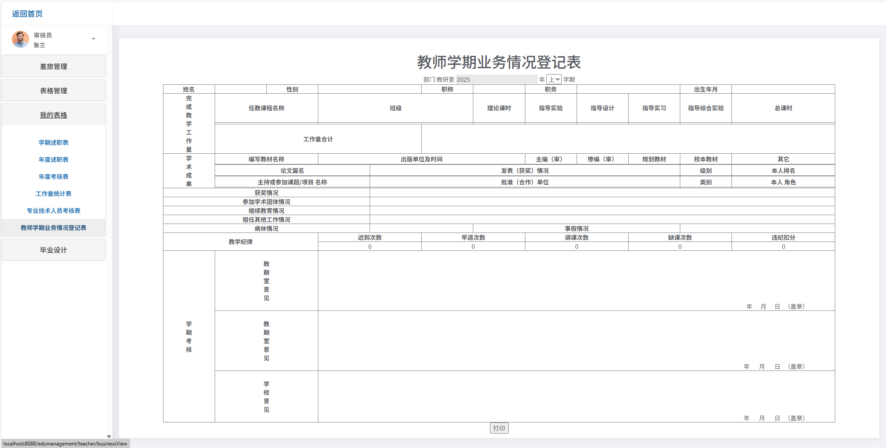
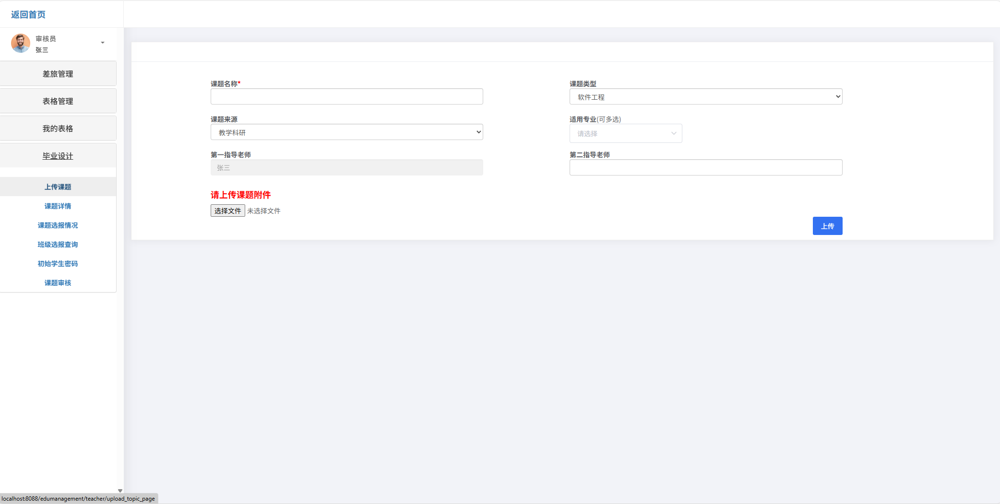
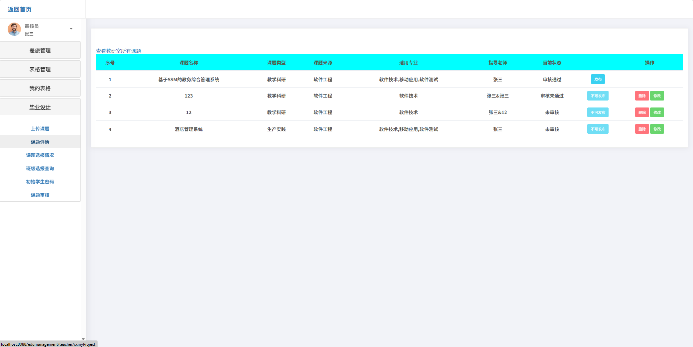
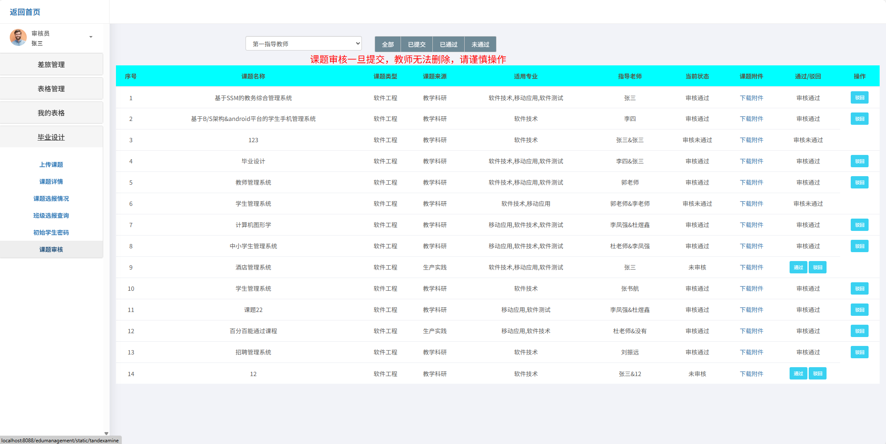
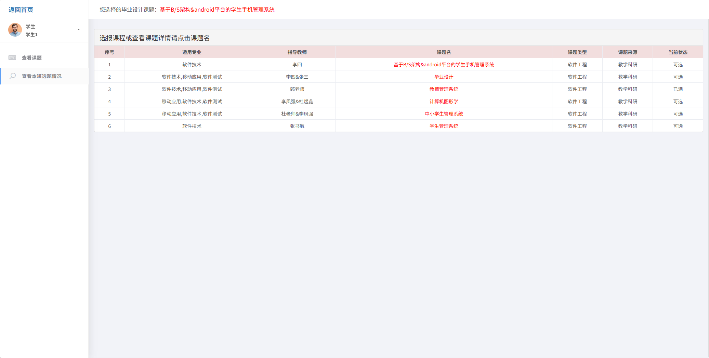
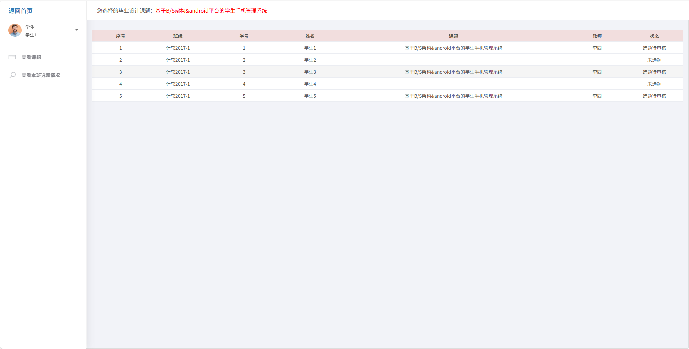

### 环境需求(可免费提供)
- idea/eclipse、jdk-1.8、maven-3.8.6、mysql、node.js等

## 有项目修改、安装调试需求 请联系以下

## 获取资源扫☝☝☝

